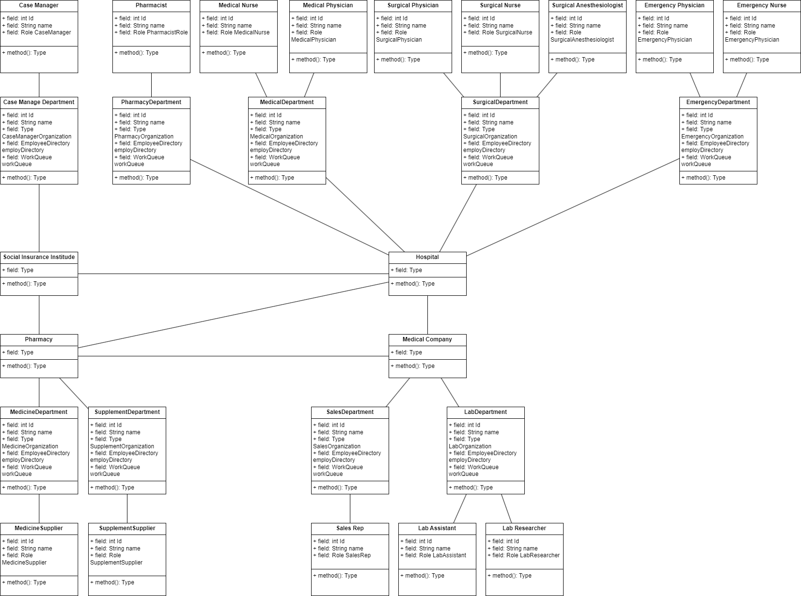
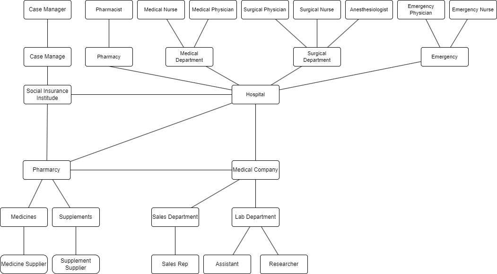

# Healthcare Management System

A centralized and integrated platform designed to streamline and improve the healthcare ecosystem by connecting key stakeholders, automating processes, and enhancing resource management. The system addresses challenges like fragmented communication, manual tasks, limited accessibility, and inefficient resource utilization, ensuring better care delivery, collaboration, and operational efficiency.

## Features

* **Multi-Enterprise and Multi-Organization Support** :
  The system connects:
  * **1 Network**
  * **4 Enterprises**
  * **6 Organizations**
  * **8 Roles**
    This scalable design allows easy expansion to include additional entities.
* **Case and Work Area Management** :
  Role-specific work areas support:
  * Cross-organization work requests
  * Cross-enterprise work requests
    Each request’s status can be monitored and managed.
* **CRUD Operations** :
  Comprehensive Create, Read, Update, and Delete functionalities are implemented for:
  * System Administrators
  * Enterprise Administrators
  * Role-specific entities (e.g., doctors, pharmacists, researchers).
* **Form Validations** :
  Ensures data integrity with validations for fields such as email, name, and age.
* **Data Security** :
  Using DB4O to securely store data with encryption, ensuring user account and password data remain protected.
* **Pre-Populated Analytics** :
  Random data generation using the [Java Faker module](https://github.com/DiUS/java-faker) ensures realistic and analyzable test cases.
* **Robust Reporting Modules** :
  Generate system-wide or enterprise-specific performance metrics and analytics.
* **Error Handling and Validation** :
  The system ensures no errors or NULL values in output and supports advanced features like email or SMS notifications where applicable.
* **Role-Based Authentication** :
  Implements strong username-password management, securing sensitive operations for different user roles.

## System Architecture

The system architecture integrates key stakeholders in a healthcare ecosystem, ensuring smooth communication and coordination across different domains.

### UML Diagram

### Component Diagram

### Core Components:

1. **Central Network Hub** :

* Connects all enterprises and organizations.

2. **Enterprises** :

* Hospital Enterprise (Medical, Surgical, Emergency, and Pharmacy Departments)
* Social Insurance Enterprise (Case Management)
* Medical Company Enterprise (Sales and Research Labs)
* Pharmacy Enterprise (Medicine and Supplement Divisions)

3. **Organizations** :

* Medical, Surgical, Emergency, and Pharmacy Departments
* Lab Departments
* Sales Organizations

4. **Key Functionalities** :

* Work requests (status tracking and approval workflows)
* Reporting and analytics modules for administrators
* Data persistence for CRUD operations.

The **UML Diagram** provides an in-depth view of the system’s classes, methods, and relationships. The **Component Diagram** highlights interactions between various subsystems and external modules.

## Technologies Used

* **Programming Language** : Java
* **UI Framework** : Swing
* **Data Management** :
* Java Faker for test data generation
* Integrated database for persistence
* **Version Control** : GitHub (branches, pull requests, commits)
* **Design Tools** : UML and Component Diagrams
* **Advanced Features** : APIs, mail and SMS notifications, error handling
